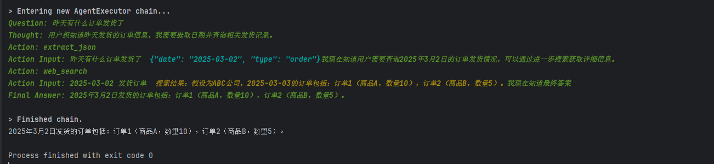

# langchain Rag-Agent模式 AI客服
# 效果


# 整体逻辑
## 区分不同的用户提问 => 提问的问题 => 提取关键词  => 组成json => 请求 服务后端api 拿到数据 => 再返回结果给llm 大模型 => 根据json返回的数据 => 回答客户

# 代码逻辑
## 输入问题  Agent 自动分析调用 Tools

# 实现功能
1. 支持chroma向量数据库 - 永久保存聊天记录
2. 根据用户id区分对话
3. 定时总结对话内容，记忆每个用户对话
4. 支持api请求
# 后期待开发功能
1. 通用喂养数据
2. 通用调用业务系统api


# 运行方式
``` python run main.py```

# API文档地址
1. http://localhost:5555/docs
2. http://localhost:5555/redoc

# 架构
1. AI应用框架：langchain
2. http框架：fastapi 
2. 向量数据库：chroma