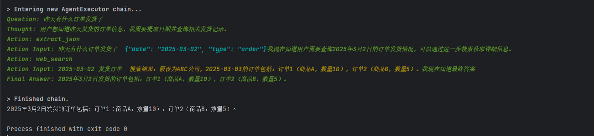

# langchain Rag-Agent模式 AI客服
# 效果

# 整体逻辑
## 区分不同的用户提问 => 根据提问的问题 => 提取出关键词  => 组成json => 请求 后端api 拿到数据 => 再返回给llm 大模型 根据json返回的数据 => 回答客户

# 代码逻辑
## 输入问题  Agent 自动分析调用 Tools


# 后期待开发功能
##  支持chroma向量数据库永久保存聊天记录
## 支持api提问


# 运行方式
``` python run tools_retriever.py```
or
```python run api.py```